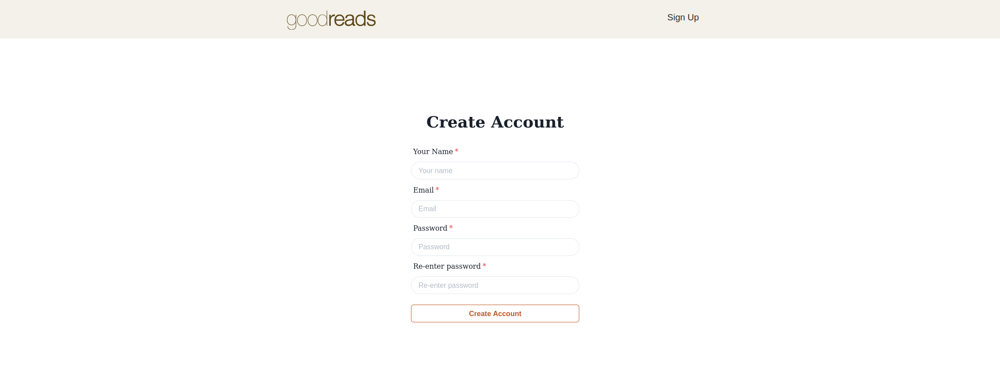
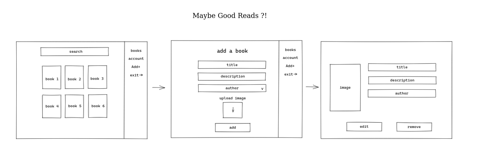

 

     <h1> 📚 Maybe Good Reads <h1>
          </img>
  

## Stack
  - [x] [Typescript](https://www.typescriptlang.org/)
  - [x] [Node.js](https://nodejs.org/en/)
  - [x] [Koa.js](https://koajs.com/)
  - [x] [MongoDB](https://www.mongodb.com/)
  - [x] [GraphQL](https://nodejs.org/en/)
  - [x] [Relay](https://relay.dev/)
  - [x] [React.js](https://reactjs.org)
  - [x] [Chakra UI](https://ant.design/)
 

## Deploy
    // In progress...

## How to run Backend
Navigate into the directory

    cd packages/server

Install all dependencies

    yarn install
    
Create .env file and fill all the variables

    mv .env-example .env

Run the server

    yarn dev
    

## How to run Frontend
Navigate into the directory

    cd packages/web

Install all dependencies

    yarn install

Run the server

    yarn dev
    
## Files architecture
    // In progress...

## Pipeline
### Backend
  - [x] GraphQL Schema
  - [x] Create Mutation
  - [x] Update Mutation
  - [x] Delete Mutation
  - [x] FindAll Query
  - [x] FindById Query
  - [ ] Authentication
### Frontend
  - [x] Homepage
  - [ ] Create bookshelf page
  - [x] Create form page
  - [ ] Create book individual page generator
  - [x] Chakra UI
  - [ ] Relay
  - [ ] Data validation
  - [ ] Search engine
### Database
  - [x] MongoDB Connection
### Docs
  - [ ] Docusaurus
  
## Queries
    // In progress...

## Prototype

    </img>

 

## Contact

[Twitter](https://twitter.com/otascar)

[Website](https://ocarmo.dev)

